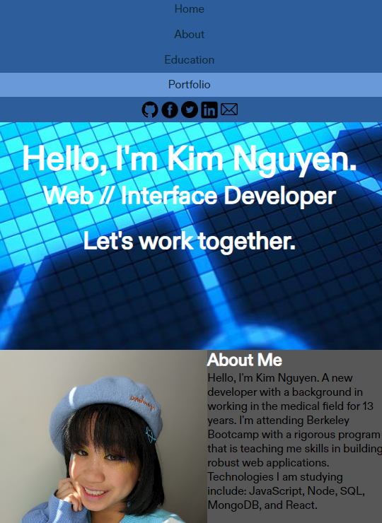
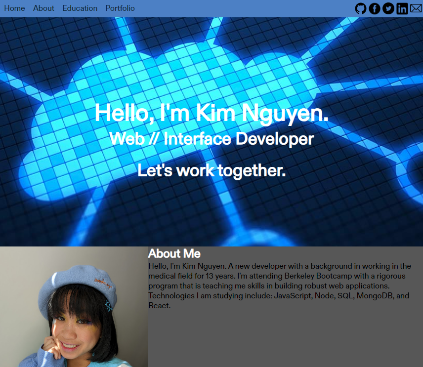

The task this week was to build our own code from scratch and creating a web portfolio. This portfolio will be added to as class progresses. This will help us show future employers what we are capable of and highlight our thought process behind work. 

Goals of this project are to use: 
    * flexbox
    * media queries and 
    * CSS variables

Practicing with these will allow us to be more successful applying the foundations of what we have learned the last few weeks.

Link: https://charmingdarling.github.io/kim-nguyen-portfolio/

